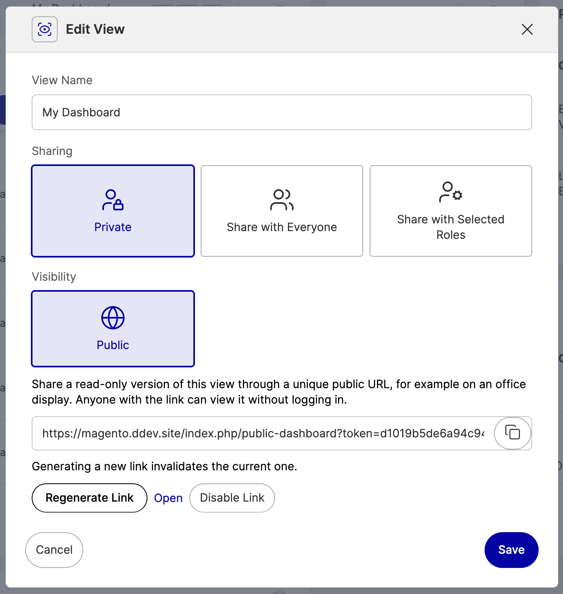

<a href="https://www.adwise.nl/">
    
</a>

# Public Dashboards for Hyvä Commerce

Share a [Hyvä Commerce Admin Dashboard](https://docs.hyva.io/hyva-commerce/features/admin-dashboard/) view through a unique, unguessable public URL — perfect for an office TV or wallboard. Anyone with the link sees a read-only version of the dashboard, without an admin login.

The module adds a **Visibility** section to the dashboard's **Edit View** modal, next to Hyvä's own Sharing options:



## Features

- **Per-view sharing** — generate, copy, open, regenerate, or disable the public link from **Edit View → Visibility → Public**
- **Faithful rendering** — the public page reuses the admin theme's styles, the dashboard's widget templates, and the same Alpine.js + ApexCharts runtime, so tables and charts look like the real dashboard
- **Read-only** — widget menus, editing, and property switchers are stripped from the public page
- **Safe by default** — 256-bit token compared with `hash_equals`, `noindex` headers, page is excluded from full page cache so a disabled link stops working immediately, regenerating invalidates the previous link
- **Auto-refresh** — the page reloads every 5 minutes to keep wallboard data current
- **Access control** — the Public option and its endpoints are gated by the `Adwise_PublicDashboard::manage` ACL resource, and links can only be generated for views the admin has access to

## How it works

The admin dashboard hydrates widgets through authenticated admin AJAX calls, which anonymous visitors don't have. The public page therefore renders every widget's content **server-side**: a frontend controller validates the token, loads the adminhtml area configuration, emulates the adminhtml area and admin theme, and renders the shared dashboard view's widget instances through the same layout handles and content utilities the dashboard's own `GetHtml` controller uses. Widgets without stored grid coordinates are packed server-side (first-fit) on the same 4-column grid.

The link is bound to the dashboard view it was generated for. The token, admin user id, and view id are stored in the `flag` table; only one public link exists at a time — generating a link for another view replaces the current one.

## Requirements

| Dependency | Version |
|---|---|
| Magento Open Source / Adobe Commerce / Mage-OS | 2.4.x |
| PHP | 8.2+ |
| hyva-themes/commerce-module-admin-dashboard | ^2.0 |
| hyva-themes/magento2-theme-module | >=1.3.21 |

> **Note:** this module requires a [Hyvä Commerce](https://www.hyva.io/hyva-commerce.html) license. The `hyva-themes/commerce-module-admin-dashboard` package is only available from Hyvä's private composer repository, which must already be configured in your project.

## Installation

```bash
composer config repositories.adwise-public-dashboards vcs https://github.com/adwise/hyva-commerce-public-dashboards
composer require adwise/module-public-dashboard
bin/magento module:enable Adwise_PublicDashboard
bin/magento setup:upgrade
bin/magento setup:di:compile
bin/magento cache:flush
```

## Usage

1. Open the admin **Dashboard** and arrange the view you want to publish.
2. Open the view switcher, click the **edit** (pencil) action of the view, and select **Public** under **Visibility**.
3. Click **Generate Public Link**, copy the URL, and open it on the wallboard device.
4. Re-open **Edit View** at any time to copy the link again, or use **Regenerate Link** / **Disable Link** to revoke access.

## Security notes

- Anyone with the URL can see the shared view's data — treat the link like a password and only display views that are safe for everyone who can see the screen.
- Regenerating or disabling the link takes effect immediately; the public page is never stored in the full page cache.
- The public page skips per-widget admin ACL checks by design: the admin explicitly published the view, and there is no admin session on the public request to evaluate them against.

## License

MIT — see [LICENSE.md](LICENSE.md)
